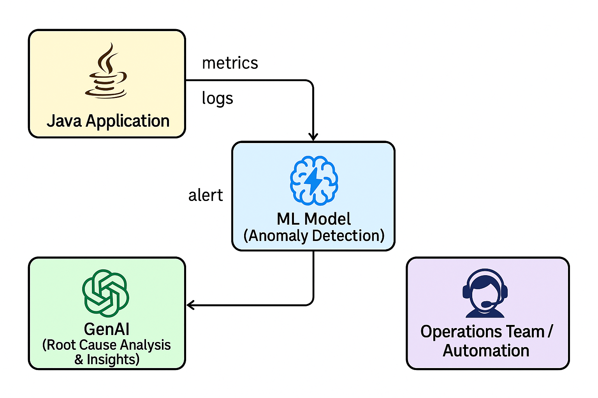
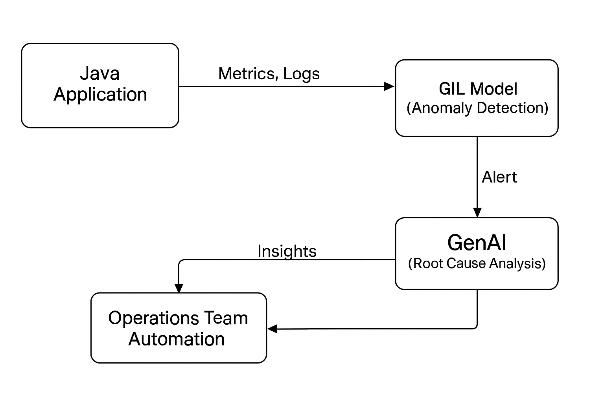

## 🧠 What is AIOps

**AIOps (AI in Ops)** helps reduce manual tasks and efforts, such as:
- SSL monitoring
- New joiner onboarding
- New infrastructure setup

---

## 🧠 AIOps Example

AIOps enables **proactive incident detection and monitoring**.

> Currently, most operations teams are reactive — resolving issues only after incidents occur. With AIOps, we can identify anomalies, predict failures, and automate responses before users are affected.

---

## 🧠 Real-World Example

**Without AIOps:**
> A user complains the app is slow → you check metrics → find high CPU → restart pod.

**With AIOps:**
> The system detects an unusual CPU trend → correlates it with recent deployment → auto-triggers rollback or scales up → no user impact.

---

## 🧠 How it Works: ML/GenAI

```mermaid
graph TD
    A[Java Application] --> B[Metrics & Logs]
    B --> C[ML Model (Anomaly Detection)]
    C --> D[Alert Triggered]
    D --> E[GenAI Module (RCA)]
    E --> F[Root Cause Summary / Suggestions]
    F --> G[Ops Team or Automation]
```


---




## 🧠 Software Requirements

| Tool                  | Role in AIOps                                     |
|-----------------------|---------------------------------------------------|
| **Anaconda**          | Python environment for ML & data science         |
| **Git**               | Version control for models, code, config         |
| **VS Code**           | IDE for development & debugging                  |
| **OpenAI**            | NLP-based log analysis, chat-based diagnostics   |
| **Google Developer Tools** | Cloud AI, monitoring APIs (Vertex AI, GCP Logs) |
| **Groq**              | AI accelerator (great for inference speed on ML models) |
| **Face (Face recognition?)** | Could be used in physical security + monitoring use cases |
